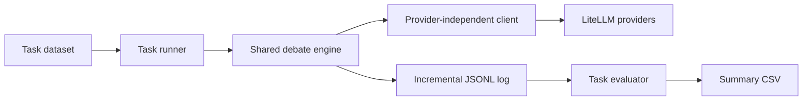

# LLM Multi-Agent Debate Lab

A compact Python research harness for studying whether several language-model instances can improve
reasoning and factuality by reviewing one another. It compares an isolated first answer with answers
after peer debate on synthetic arithmetic, GSM8K, MMLU, and cited computer-scientist biographies.

This is a clean-room modernization inspired by Du et al., [*Improving Factuality and Reasoning in
Language Models through Multiagent Debate*](https://arxiv.org/abs/2305.14325), and its
[preliminary implementation](https://github.com/composable-models/llm_multiagent_debate). No source
code or dataset file was copied from that repository.

## Why this is an AI engineering project

The interesting engineering problem is not pretending that several API calls are autonomous people.
It is designing a controlled experiment:

1. Agents answer independently in round zero.
2. Later rounds receive only the other agents' *completed previous-round* responses.
3. Objective tasks normalize answers and use deterministic majority voting.
4. Every prompt, response, parse result, token count, latency, error, and configuration is saved.
5. Evaluation compares a direct baseline with the debate result while exposing cost and parse
   failures.

That separation between treatment, baseline, measurement, and observability is directly relevant to
LLM evaluation, agent orchestration, and production AI systems.

## Architecture



The shared package is under `src/multiagent_debate`. Each folder under `tasks` contains only the data
adapter, prompt, parser choice, and thin command-line entry points. See
[`docs/ARCHITECTURE.md`](docs/ARCHITECTURE.md) for the data flow and extension points.

## Research grounding

The project is informed by both positive and critical results in the multi-agent debate literature.
The critical work matters: strong single-agent prompting and self-consistency can sometimes match or
beat debate at lower cost, while model and role diversity can matter more than simply adding agents.
See [`docs/RELATED_WORK.md`](docs/RELATED_WORK.md) for an annotated reading list, implications for
experimental design, and three prioritized engineering extensions. Reusable BibTeX entries are in
[`references.bib`](references.bib).

## Setup

Python 3.11 through 3.14 is supported.

```bash
cd /Users/sujaygopal/MyProjects/llm_multiagent_debate
python3 -m venv .venv
source .venv/bin/activate
python -m pip install --upgrade pip
python -m pip install -e ".[dev]"
cp .env.example .env
```

Put only the provider key you need in `.env`. The file is ignored by Git. LiteLLM accepts provider-
qualified models, for example:

| Provider | Model argument | Environment variable |
|---|---|---|
| OpenAI | `openai/gpt-5-mini` | `OPENAI_API_KEY` |
| Anthropic | `anthropic/claude-sonnet-4-5-20250929` | `ANTHROPIC_API_KEY` |
| Gemini | `gemini/gemini-2.5-flash` | `GEMINI_API_KEY` |
| Local Ollama | `ollama/llama3.2` | none by default |
| Offline demo | `fake/deterministic` | none |

Provider model names change. Check the relevant provider and
[LiteLLM documentation](https://docs.litellm.ai/docs/) rather than treating the example names as a
permanent recommendation.

## Run experiments

Every runner defaults to 10 seeded examples. Use `--limit 0` only after estimating the number of API
calls: roughly `examples × agents × rounds`.

For an experiment with stronger controls, add `--baselines all` to an objective-task runner. This
adds private self-refinement and compute-matched independent sampling; first-round self-consistency
is always reported without extra calls. Start with `fake/deterministic` or a small `--limit` because
these optional baselines increase live-provider usage. See
[`docs/STATISTICAL_EVALUATION.md`](docs/STATISTICAL_EVALUATION.md) for call counts and interpretation.

### Arithmetic

```bash
cd tasks/arithmetic
python run.py --model fake/deterministic
python evaluate.py
```

Arithmetic needs no download and evaluates automatically.

### GSM8K

```bash
cd tasks/gsm8k
python download_data.py
python run.py --model openai/gpt-5-mini
python evaluate.py
```

The downloader saves the `main/test` split from
[`openai/gsm8k`](https://huggingface.co/datasets/openai/gsm8k) and records its fingerprint.

### MMLU

```bash
cd tasks/mmlu
python download_data.py
python run.py --model openai/gpt-5-mini --subject machine_learning
python evaluate.py
```

The downloader saves the `all/test` split from
[`cais/mmlu`](https://huggingface.co/datasets/cais/mmlu). Omit `--subject` to sample across all 57
subjects. This project uses zero-shot prompts; it does not claim equivalence to MMLU's five-shot
evaluation protocol.

### Biographies

```bash
cd tasks/biographies
python run.py --model openai/gpt-5-mini
python evaluate.py --judge-model openai/gpt-5
```

The included dataset has 10 people and institutional source URLs. The judge sees only the supplied
reference facts. Its `absent` label means “not verifiable from this closed reference,” not “false.”
For a credible experiment, use a stronger judge from a different model family and manually audit a
sample of judgments.

## Common options

```text
--agents N          number of parallel debaters
--rounds N          total rounds, including the independent first round
--limit N           examples to run; zero means all
--seed N            sampling seed and provider seed when supported
--temperature X     sampling temperature
--max-tokens N      response token ceiling
--baselines NAME    optional self-refinement/compute-matched controls (objective tasks)
--output-dir PATH   base directory for timestamped runs
--resume RUN_DIR    skip example IDs already present in that run's JSONL
```

Arithmetic defaults to two agents and three rounds, matching the referenced prototype. The other
tasks default to three agents and two rounds. A direct prediction is agent 0's independent round-zero
answer. The debate prediction is final-round majority vote; ties use agent 0's final answer and are
flagged. Biography text is not majority-voted: agent 0 is compared before and after debate, and all
final agents are also scored.

## Outputs

Each run creates `outputs/<timestamp>_<task>_<model>_<experiment-id>/`:

```text
config.json                  immutable run configuration and dataset metadata
results.jsonl                one complete, append-only record per example
summary.csv                  per-strategy quality and efficiency statistics
comparisons.csv              paired confidence intervals and exact McNemar tests
biography_judgments.jsonl    biography judge evidence (biography task only)
```

Every result record includes the original prompt and reference, all agent requests and responses,
round-level normalized answers, the direct and debate predictions, token/latency/cost metadata when
the provider exposes it, parse status, and recoverable errors. JSONL is flushed after every example,
so an interrupted job can be resumed without repeating completed IDs.

For objective tasks, `summary.csv` includes direct reasoning, first-round self-consistency, optional
self-refinement and compute-matched self-consistency, intermediate debate rounds, and final debate.
`comparisons.csv` treats parse failures as incorrect and compares each strategy with the same direct
examples using a seeded paired bootstrap interval and an exact two-sided McNemar test.

## Interpreting results responsibly

- Debate uses more inference calls than a direct answer. Report accuracy and cost/latency together.
- API sampling is not perfectly deterministic even when a provider accepts a seed.
- A majority can amplify a shared misconception; agreement is not evidence of truth.
- The direct baseline is one agent's first response. Final majority voting also benefits from multiple
  samples, so the evaluator reports round-zero majority as a self-consistency control.
- LLM judges can favor their own model family and can misunderstand the reference. Audit judgments.
- Small 10-item runs are smoke tests, not statistically persuasive benchmark results.

Use [`docs/EXPERIMENT_REPORT.md`](docs/EXPERIMENT_REPORT.md) to document model versions, dataset
fingerprints, hypotheses, confidence intervals, failures, and limitations before publishing results.

## Add a model provider or task

Most providers require no new code: pass LiteLLM's provider-qualified model name. For a custom
backend, implement the five-argument `LLMClient.generate` protocol and return a normalized
`Generation`.

To add a benchmark, write a thin loader that returns `Example` objects, choose an answer parser,
specify the final-answer instruction, and call `run_experiment`. Keep task-specific schemas and
metrics outside the debate engine.

## Development

```bash
ruff check .
pytest
python -m compileall -q src tasks tests
```

Network/API tests should be marked `integration` and are excluded from ordinary offline validation.
Project conventions for future coding agents are in [`AGENT.md`](AGENT.md).

## Portfolio and interview framing

**Resume bullet:** Built a provider-agnostic Python evaluation harness that orchestrates multi-round
LLM debates across four reasoning/factuality benchmarks, captures reproducible JSONL traces and
efficiency telemetry, and compares direct responses with majority-voted debate outcomes.

**Technical explanation:** “I separated model access, debate orchestration, task parsing, and
evaluation so I could swap providers without changing experimental logic. I also snapshot responses
between rounds to prevent ordering leakage and log parse failures rather than silently dropping bad
outputs.”

**Recruiter explanation:** “The project tests whether AI models can improve an answer by reviewing
other AI answers, while measuring whether the improvement is worth the extra time and cost.”

## Citation

```bibtex
@article{du2023improving,
  title={Improving Factuality and Reasoning in Language Models through Multiagent Debate},
  author={Du, Yilun and Li, Shuang and Torralba, Antonio and Tenenbaum, Joshua B. and Mordatch, Igor},
  journal={arXiv preprint arXiv:2305.14325},
  year={2023}
}
```

The project code is MIT licensed. GSM8K and MMLU retain their respective dataset terms and citations.
