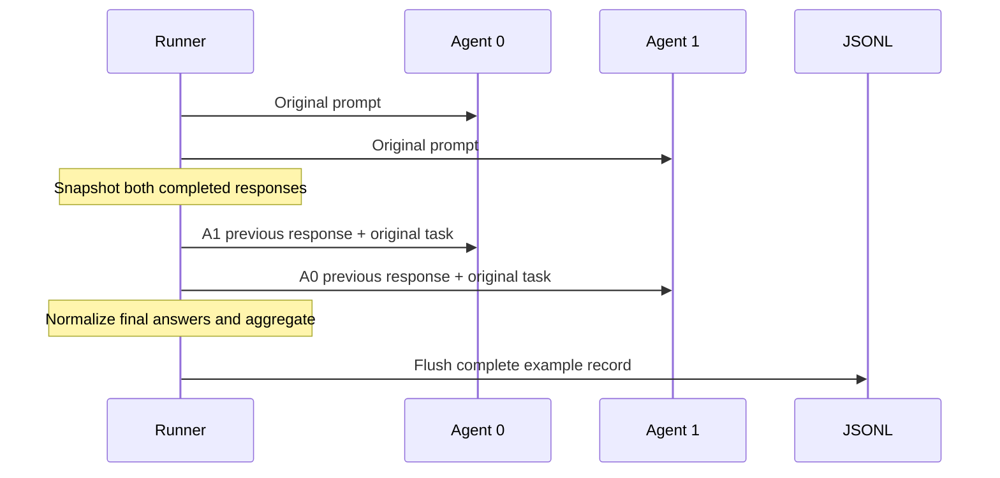

# Architecture

## Boundaries

The system has four deliberately small layers:

1. **Task adapter:** turns a dataset row into an `Example` and selects an answer parser.
2. **Debate engine:** owns histories, previous-round snapshots, model calls, and aggregation.
3. **Model client:** translates the shared `Message` and `Generation` types to a provider SDK.
4. **Evaluator:** reads saved records. It never needs to rerun generation.

This prevents provider details from leaking into benchmark logic and lets evaluation be repeated after
the expensive generation step.

## Debate sequence

An agent never sees an answer produced earlier in the same round. Without this snapshot, sequential
execution would silently give later agents more information and confound comparisons.

## Public interfaces

- `LLMClient.generate(messages, model, temperature, max_tokens, seed) -> Generation`
- `run_debate(example, config, client, parse_answer, answer_instruction) -> dict`
- `run_experiment(examples, config, client, parse_answer, ...) -> results_path`
- `evaluate_objective(results_path, group_by=None) -> summary_rows`

The JSONL schema is versioned at `1.0`. Additive fields are safe; renaming or changing existing field
meaning requires a schema version change and a migration note.

## Failure model

Provider failures are retried with a bounded exponential backoff. Exhausted failures are serialized on
the affected turn and produce a parse failure rather than terminating the full experiment. Each
example is appended and flushed independently. `--resume` treats `example_id` as the idempotency key.

